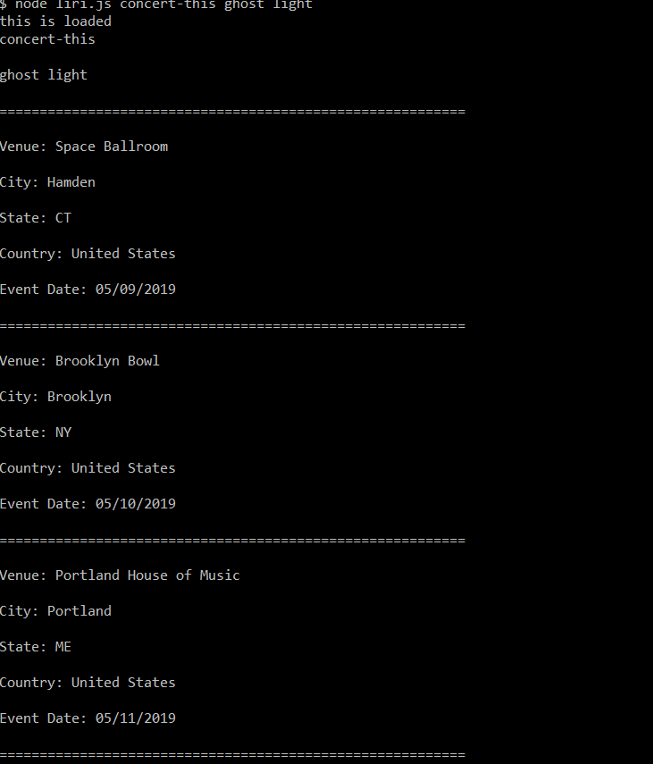
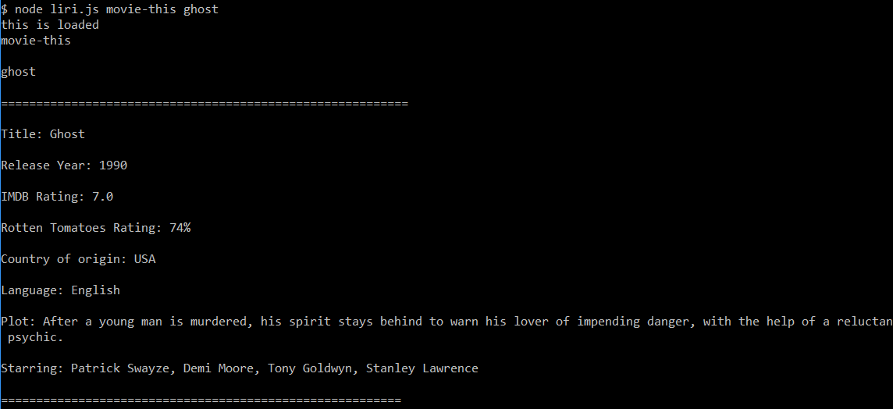
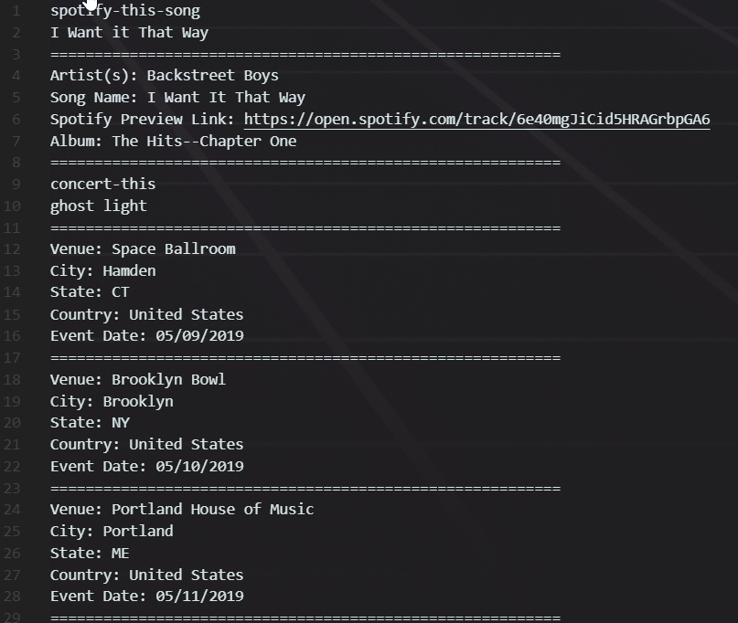

# liri-node-app

## Overview

### Liri is like Siri!
We can use this application to get info :

      about               from APIs
      __________________________________
      Concert            bandsintown
      song               spotify
      movie              omdb

## npm Dependencies
    dotenv
    node-spotify-api
    axios
    moment

## Logic :

Storing all the output in an array.
Code for displaying to terminal and appending to log.txt is at the end.

#### concert-this : will display band/artist related name of venue, location, date of event from bandsintown

##### COMMAND =>  node liri.js concert-this ghost light
##### OUTPUT =>

##### CODE =>

#### spotify-this-song : will display song related artist, name, link, album info from spotify

##### COMMAND =>  node liri.js spotify-this-song "I Want it That Way"
##### OUTPUT =>

##### CODE =>

#### movie-this : will display movie related title, year, rating, country, language,plot, actors from omdb

##### COMMAND =>  node liri.js movie-this ghost
##### OUTPUT =>

##### CODE =>

#### data storage in log.txt
##### log.txt data =>

##### CODE =>

#### No arguments and/or only one argument related outputs
##### OUTPUT =>

